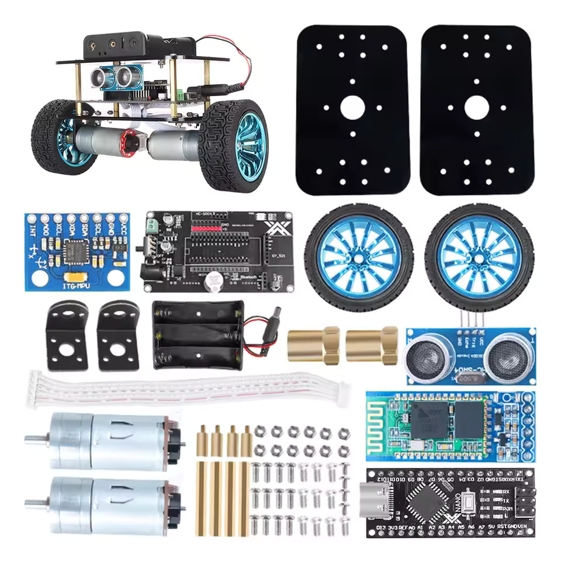

# Balance Bot ATmega328P

Rust implementation of a self-balancing robot using ATmega328P (Arduino Nano) from AliExpress.

## Demo Video
[](https://www.youtube.com/shorts/JpB8rNLy2rc)

## Hardware



### Components
- ATmega328P microcontroller (Arduino Nano)
- MPU6050 gyroscope/accelerometer
- TB6612 motor driver
- 2x DC motors with encoders
- HC-SR04 ultrasonic distance sensor
- RGB LED for status indication

### Pin Configuration
| Pin | Function |
|-----|----------|
| D2 | Left encoder (INT0) |
| D3 | HC-SR04 trigger |
| D4 | Right encoder (PCINT20) |
| D5 | HC-SR04 echo (PCINT21) |
| D6, D7 | Right motor direction |
| D8 | TB6612 enable |
| D9 | Right motor PWM |
| D10 | Left motor PWM |
| D12, D13 | Left motor direction |
| A0 | Red LED |
| A1 | Green LED |
| A2 | Blue LED |
| A4, A5 | I2C (MPU6050) |

## Features

### Implemented
- **Balancing**: PD control for angle, PI control for speed
- **Sensor fusion**: Kalman filter combining gyroscope and accelerometer
- **Distance sensing**: HC-SR04 with interrupt-driven measurement and EMA smoothing
- **Obstacle avoidance**:
  - Distance < 20cm: drive backwards (Blue LED)
  - Distance 20-60cm: drive forwards (Green LED)
  - Distance > 60cm: stay stationary (Red LED)
- **Fall recovery**: Automatic CPU reset when robot is placed upright after falling
- **Real-time plotting**: Serial output compatible with matplotlib plotting script

### Not Yet Implemented
- Bluetooth remote control
- PID auto-tuning

## Build Instructions

### Prerequisites

#### Option 1: Dev Container (Recommended)
If you have Docker and VS Code with the Dev Containers extension:
1. Open the project folder in VS Code
2. Click "Reopen in Container" when prompted
3. All dependencies are pre-installed

#### Option 2: Manual Installation
Install the following:
- **Rust nightly-2024-03-22** with `rust-src` component
- **AVR toolchain**: `gcc-avr`, `binutils-avr`, `avr-libc`, `avrdude`
- **ravedude**: `cargo install ravedude`

```bash
# Install Rust toolchain
rustup toolchain install nightly-2024-03-22 --component rust-src

# On Ubuntu/Debian
sudo apt install gcc-avr binutils-avr avr-libc avrdude

# Install ravedude for flashing
cargo install ravedude
```

### Building

**Important**: Only release builds work due to AVR code size constraints.

```bash
# Build the firmware
cargo build --release

# Build and flash to connected Arduino Nano
./rave

# Or manually with ravedude
ravedude nano -cb 57600 target/avr-atmega328p/release/balance_bot_328p.elf
```

### Serial Console

After flashing, ravedude opens a serial console at 57600 baud. Debug output shows:
- Encoder ticks and motor PWM values
- Accelerometer and gyroscope readings
- Computed angles (raw, accelerometer-only, Kalman-filtered)
- Control outputs (angle PD, speed PI, integral)
- Distance sensor readings (raw and smoothed)
- Timing information

### Real-time Plotting

To visualize sensor data in real-time:

```bash
./rave | ./scripts/plot_all.py
```

Requires Python 3 with matplotlib and numpy.

## Tuning

Key parameters in `src/control.rs`:

```rust
// Angle PD control
const KP_BALANCE: f32 = 23.0;
const KD_BALANCE: f32 = 0.48;
const ANGLE_ZERO: f32 = -0.17;  // Angle offset for balance point

// Speed PI control
const KP_SPEED: f32 = 7.52;
const KI_SPEED: f32 = 12.398;

// Distance thresholds (in ControlState)
distance_close_threshold: 20,   // cm
distance_medium_threshold: 60,  // cm
speed_backward: -5.0,
speed_forward: 5.0,
```

## Architecture

```
┌─────────────────────────────────────────────────────────────┐
│                      Main Loop                               │
│  - Poll distance sensor (non-blocking)                      │
│  - Update target speed based on distance                    │
│  - Debug output every 300ms                                 │
└─────────────────────────────────────────────────────────────┘
                              │
┌─────────────────────────────────────────────────────────────┐
│                   TIMER2 Interrupt (100Hz)                   │
│  - Read MPU6050 (I2C)                                       │
│  - Read encoder speeds                                      │
│  - Kalman filter update                                     │
│  - PD angle control                                         │
│  - PI speed control                                         │
│  - PWM output to motors                                     │
└─────────────────────────────────────────────────────────────┘
                              │
┌─────────────────────────────────────────────────────────────┐
│                   PCINT2 Interrupt                           │
│  - Right encoder tick counting (PD4)                        │
│  - HC-SR04 echo timing (PD5)                                │
└─────────────────────────────────────────────────────────────┘
```

## License

Licensed under either of:
- Apache License, Version 2.0 ([LICENSE-APACHE](LICENSE-APACHE) or <http://www.apache.org/licenses/LICENSE-2.0>)
- MIT license ([LICENSE-MIT](LICENSE-MIT) or <http://opensource.org/licenses/MIT>)

at your option.
